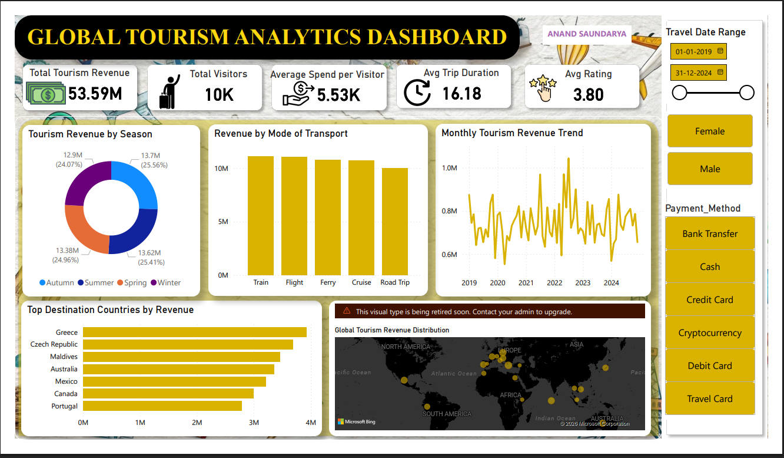

# Global Tourism Analytics Dashboard (2019–2024)

A comprehensive performance report and data visualization project analyzing global travel patterns, revenue metrics, and traveler demographics over a six-year period.
### Dashboard

## 📊 Project Overview
This repository contains a deep-dive analysis into the global tourism industry. Using a dataset of **10,000 traveler records** and **35 data dimensions**, the project tracks industry resilience through the COVID-19 pandemic and identifies the emerging trends of 2026.

### Key Performance Indicators (KPIs)
* **Total Revenue:** $55.35 Million
* **Total Visitors:** 10,000
* **Avg. Spend per Visitor:** $5,535
* **Avg. Trip Duration:** 16.21 Days
* **Customer Satisfaction:** 3.80 / 5.0

## 🗂️ Project Structure
* `Tourism_Analytics_Report.docx`: Detailed textual analysis and strategic recommendations.
* `Tourism_Analytics.pptx`: Visual dashboard and slide deck summarizing key findings.
* `Data/`: (Add your dataset file here)

## 📈 Key Insights
### 1. Market Resilience
Despite the global pandemic, 2020 revenue only dipped by **1.3%**. This was followed by a massive **7.3% "revenge travel" boom in 2022**, reaching a peak of $9.86M in annual revenue.

### 2. Top Destinations by Revenue
| Rank | Destination | Total Revenue | Avg. Spend/Visitor |
| :--- | :--- | :--- | :--- |
| 1 | Greece | $4.03M | $9,394 |
| 2 | Czech Republic | $3.87M | $10,187 |
| 3 | Maldives | $3.53M | $8,170 |

### 3. Payment & Behavior Trends
* **Fintech Shift:** Cryptocurrency now accounts for **15.1%** of total revenue, nearly rivaling traditional Credit Cards (17.7%).
* **Sustainability:** **40.3%** of travelers now make eco-conscious tourism choices.
* **Transport:** Train travel ($11.49M) is the leading revenue generator, narrowly surpassing Flights ($11.37M).

## 🛠️ Tools Used
* **Power BI:** For dashboard creation and data modeling.
* **Microsoft Word:** For comprehensive performance reporting.
* **Microsoft PowerPoint:** For executive-level data storytelling.

## 💡 Strategic Recommendations
* **Loyalty Programs:** With only **29.5%** repeat visitors, there is significant headroom to improve retention through structured rewards.
* **Seasonal Marketing:** Target the **6.4% seasonal gap** in Winter revenue with specific off-peak promotional pricing.
* **Digital Strategy:** Prioritize mobile-first booking tools, as **50%** of travelers now utilize travel apps.

---
**Prepared by:** Anand Saundarya  
**Date:** April 2026
